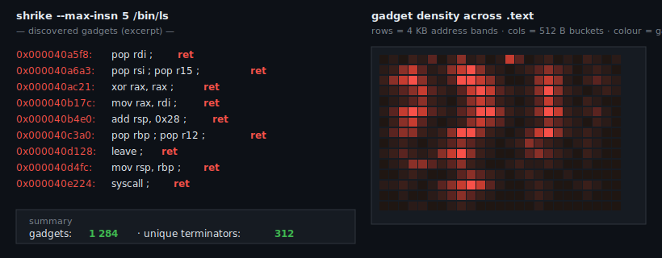

# shrike

<p align="center">
  
</p>

[](LICENSE)
[](https://en.wikipedia.org/wiki/C99)
[](https://refspecs.linuxfoundation.org/elf/)

Minimal ROP gadget finder for x86-64 ELF64 binaries, written from
scratch in pure C99. Parses the ELF, walks executable PT_LOAD
segments, decodes instruction lengths with a small table-driven
decoder, and enumerates return-terminated gadget sequences.

Named after the shrike — a songbird that impales its prey on thorns
for later retrieval. Appropriate.

> **Status:** v0.2.0 — filter, dedup, limit, expanded mnemonics.
> See [CHANGELOG.md](CHANGELOG.md).

---

## Why

[ROPgadget](https://github.com/JonathanSalwan/ROPgadget) exists and
is excellent. It is also Python with a large dependency tree.
`shrike` is the thing you put in a static binary to drop onto a
locked-down audit host — same output shape, zero runtime
dependencies, auditable in an afternoon. It also pairs naturally
with [lbr-hunt](https://github.com/bauratynov/lbr-hunt): static
gadget enumeration (shrike) + runtime chain detection via Intel LBR.

## Design

- **C99, no external dependencies** beyond `<string.h>` / `<stdio.h>` /
  `<sys/mman.h>`. One source tree, readable end-to-end.
- **Bounds-checked ELF loader.** Every offset validated against file
  size before dereferencing. Malformed binaries refused, not parsed
  into undefined behaviour.
- **Table-driven length decoder.** A 256-entry primary opcode map,
  a classifier for the 0x0F two-byte map, and generous defaults for
  the 3-byte 0x38 / 0x3A maps. Sufficient for gadget enumeration;
  not a full disassembler.
- **Walk backward from terminators.** For each `ret` / `retf` / `int`
  / `syscall` / `sysret` / indirect `call` / indirect `jmp` byte,
  try decoding instruction chains backwards; emit sequences that
  land exactly on the terminator.

## Build

```bash
make
./shrike /bin/ls
```

## Usage

```bash
# Dump all gadgets in /bin/ls
./shrike /bin/ls

# Longer gadgets, wider scan, summary-only output
./shrike --max-insn 8 --back 64 --quiet /bin/bash

# Only plain RET-terminated gadgets (skip syscall / int / indirect)
./shrike --no-syscall --no-int --no-ind /bin/ls

# v0.2.0: search for a specific gadget without shelling through grep
./shrike --filter 'pop rdi ; ret' /bin/bash

# v0.2.0: one copy of each distinct chain, stop after 50
./shrike --unique --limit 50 /bin/bash

# Useful composition: every unique "pop rXX ; ret" chain
./shrike --unique --filter 'pop ' --filter-ret-tail /bin/ls  # conceptual
```

Example output:

```
# file: /bin/ls
# type: ET_DYN  entry: 0x6ab0  segments: 2
# segment[0]: vaddr=0x0000000000001000  bytes=24288
0x000000000000108c: pop rbp ; ret
0x0000000000001290: pop rdi ; ret
0x0000000000001292: ret
0x000000000000218c: xor eax, eax ; ret
...
shrike: 1284 gadgets emitted
```

## Exit codes

| Code | Meaning                                   |
|------|-------------------------------------------|
| 0    | clean run                                 |
| 1    | runtime error (unreadable file, mmap fail)|
| 2    | bad invocation                            |

## Layout

```
shrike/
├── LICENSE / SECURITY.md / CHANGELOG.md
├── Makefile
├── include/{elf64,xdec,scan,format}.h
├── src/elf64.c         # bounds-checked loader
├── src/xdec.c          # x86-64 length decoder
├── src/scan.c          # backward gadget scanner
├── src/format.c        # mnemonic printer + hex fallback
├── src/main.c          # CLI
├── tests/
│   ├── test_xdec.c     # 40+ length-decoder unit cases
│   ├── test_scan.c     # scanner unit cases
│   └── integration.sh  # /bin/ls, /bin/bash, /bin/cat smoke
├── docs/hero.svg
└── .github/workflows/ci.yml
```

## Roadmap

- [x] Sprint 1: ELF64 loader + CLI skeleton
- [x] Sprint 2: x86-64 length decoder + unit tests
- [x] Sprint 3: gadget scanner + mnemonic printer
- [x] Sprint 4: CI + integration tests + v0.1.0
- [x] v0.2.0: `--filter` / `--unique` / `--limit` + more mnemonics
- [ ] v0.3.0: regex filter, CET-aware classification, colour output
- [ ] v0.4.0: ARM64 support (sibling length decoder)

## Companion tools

- [lbr-hunt](https://github.com/bauratynov/lbr-hunt) — runtime ROP
  detection via Intel LBR. Static enumeration (shrike) + runtime
  detection (lbr-hunt) gives full-coverage mitigation audit.
- [checkhard](https://github.com/bauratynov/checkhard) — ELF
  hardening auditor: PIE, NX, RELRO, canary, FORTIFY, RPATH, RWX.

## References

- Shacham, H. *The Geometry of Innocent Flesh on the Bone:
  Return-into-libc without Function Calls (on the x86)*, CCS 2007 —
  the original ROP paper.
- Intel® 64 and IA-32 Architectures Software Developer's Manual,
  Vol. 2: Instruction Set Reference.
- [ROPgadget](https://github.com/JonathanSalwan/ROPgadget) — the
  Python reference that `shrike` converges toward in scope.

## License

MIT — see [LICENSE](LICENSE).

## Author

**Baurzhan Atynov** — [bauratynov@gmail.com](mailto:bauratynov@gmail.com)
